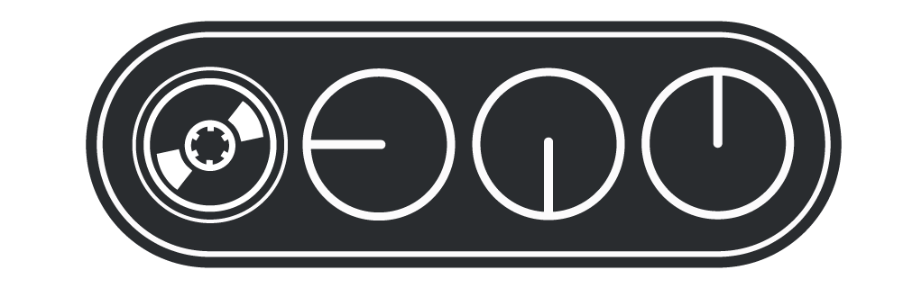
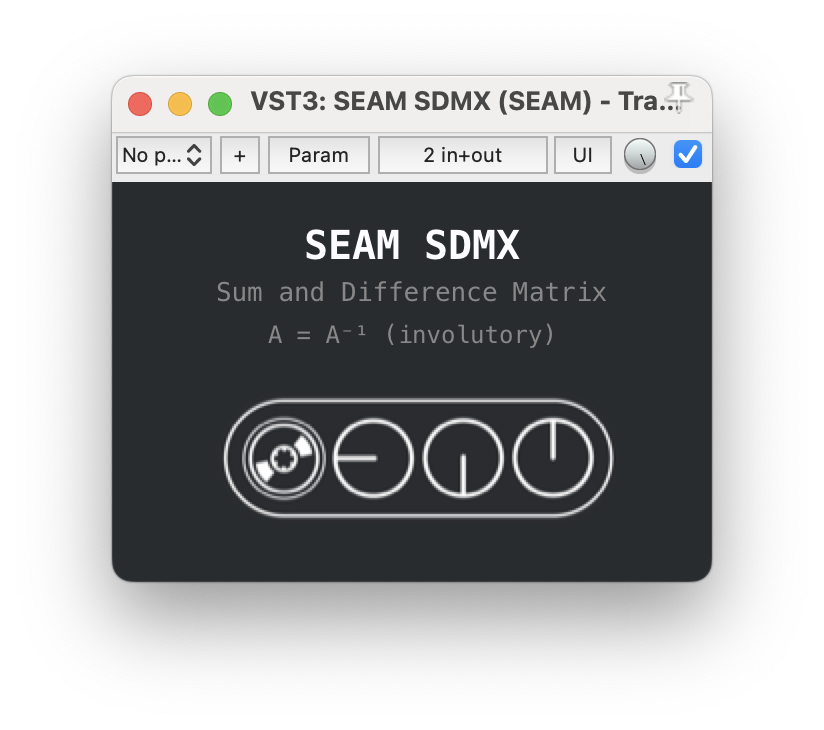
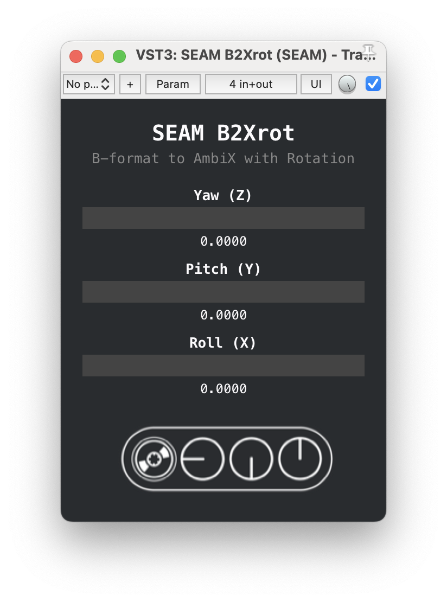
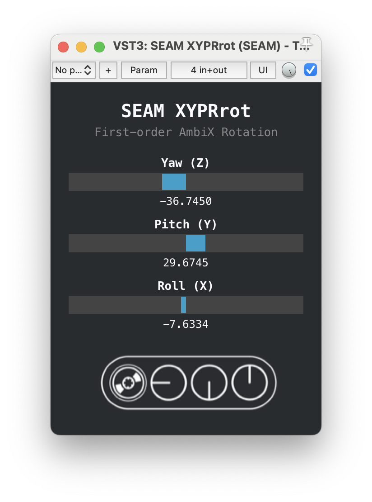
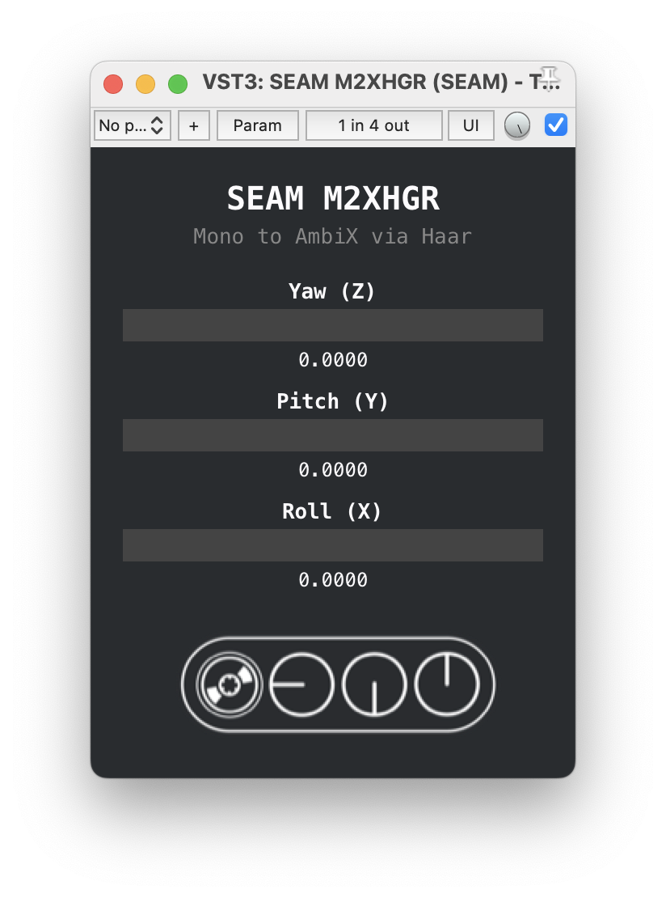
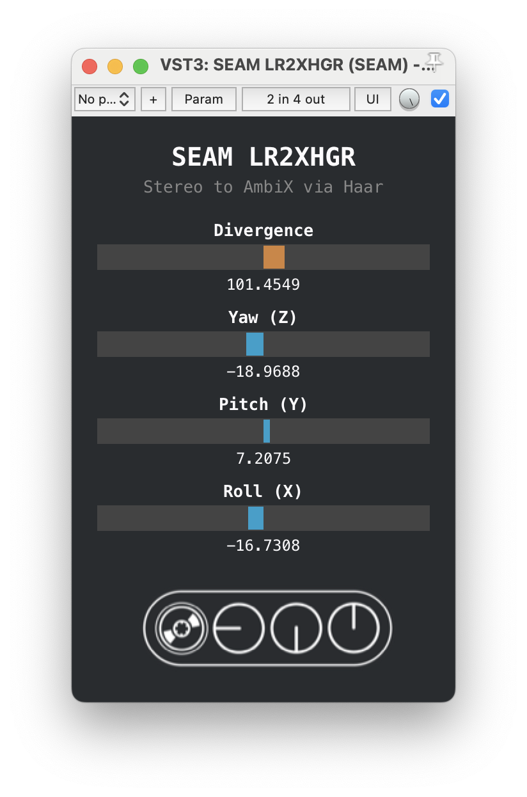

# SEAM-LTM — Learning Through Making



A pedagogical VST3 plugin suite for the [SEAM](https://github.com/s-e-a-m)
project (Sustained Electro-Acoustic Music).

Five plugins built directly on the Steinberg VST3 SDK — no JUCE, no
frameworks. Clean C++17, VSTGUI for the interface, and the minimum code
needed to do the job.

## Plugins

| Plugin | I/O | Description |
|---|---|---|
| **SDMX** | stereo &rarr; stereo | Sum and Difference Matrix (MS encoding/decoding). Involutory: A = A⁻¹ |
| **B2Xrot** | B-format &rarr; AmbiX | Classic B-format to first-order AmbiX conversion with YPR rotation |
| **M2XHGR** | mono &rarr; AmbiX | Mono to first-order AmbiX via Haar encoding with YPR rotation |
| **LR2XHGR** | stereo &rarr; AmbiX | Stereo to first-order AmbiX via Haar with divergence control and YPR rotation |
| **XYPRrot** | AmbiX &rarr; AmbiX | First-order AmbiX rotation (Yaw, Pitch, Roll) |

### Screenshots

| SDMX | B2Xrot | XYPRrot |
|:---:|:---:|:---:|
|  |  |  |

| M2XHGR | LR2XHGR |
|:---:|:---:|
|  |  |

## Requirements

### Common

- CMake 3.25+
- [VST3 SDK](https://github.com/steinbergmedia/vst3sdk) cloned at `../../sdk/vst3sdk` relative to this repo

### macOS

- Xcode (not just Command Line Tools — the SDK cmake needs the full app)
- Tested on macOS 15 Sequoia

### Linux (Arch / Manjaro)

```bash
sudo pacman -S base-devel cmake gcc pkg-config \
    libx11 libxcb xcb-util xcb-util-cursor \
    cairo pango fontconfig freetype2 \
    libxkbcommon gtk3
```

### Linux (Debian / Ubuntu)

```bash
sudo apt install build-essential cmake pkg-config \
    libx11-dev libxcb1-dev libxcb-util-dev libxcb-cursor-dev \
    libcairo2-dev libpango1.0-dev libfontconfig1-dev libfreetype6-dev \
    libxkbcommon-dev libgtk-3-dev
```

## Build

### macOS

```bash
cmake -B build-release -DCMAKE_BUILD_TYPE=Release -GXcode
cmake --build build-release --config Release -j8
```

Plugins are output to `build-release/VST3/Release/` and automatically
symlinked to `~/Library/Audio/Plug-Ins/VST3/`.

### Linux

```bash
cmake -B build-release -DCMAKE_BUILD_TYPE=Release
cmake --build build-release --config Release -j$(nproc)
```

Plugins are output to `build-release/VST3/Release/`.
To install system-wide:

```bash
# Copy all .vst3 bundles to the standard VST3 path
cp -r build-release/VST3/Release/*.vst3 ~/.vst3/
```

Most Linux DAWs (Ardour, REAPER, Bitwig, Carla) scan `~/.vst3/` automatically.

## Design

### DSP
Each plugin implements its DSP in a single `processMatrix` or
`processAudio` template, supporting both 32-bit and 64-bit sample formats.
The math follows the Faust reference implementations in
[seam.stereophony.lib](https://github.com/s-e-a-m/faust-libraries) and
the Gerzon/Blumlein theoretical framework.

### GUI
All plugins share a consistent visual identity:

- **300px wide**, variable height
- **Source Code Pro Light** monospace font throughout
- Dark background (#292c2f), light text
- Horizontal sliders with center-origin fill (bipolar rotation controls)
- SEAM logo at bottom

### Architecture
Built on `SingleComponentEffect` (processor + controller in one class).
No external dependencies beyond the VST3 SDK and VSTGUI.
Cross-platform: macOS (Xcode) and Linux (GCC/Clang).

## Theory

The plugin suite covers the Blumlein &rarr; Gerzon lineage of spatial audio:

- **Blumlein (1933)**: sum-and-difference matrix for MS stereophony
- **Gerzon (1973)**: Ambisonics as a generalization of Blumlein's principles
- **Haar transform**: orthogonal encoding of stereo/mono signals into Ambisonic B-format

## License

GPL-3.0 — see [LICENSE](LICENSE).

## Author

Giuseppe Silvi — [s-e-a-m](https://github.com/s-e-a-m)
