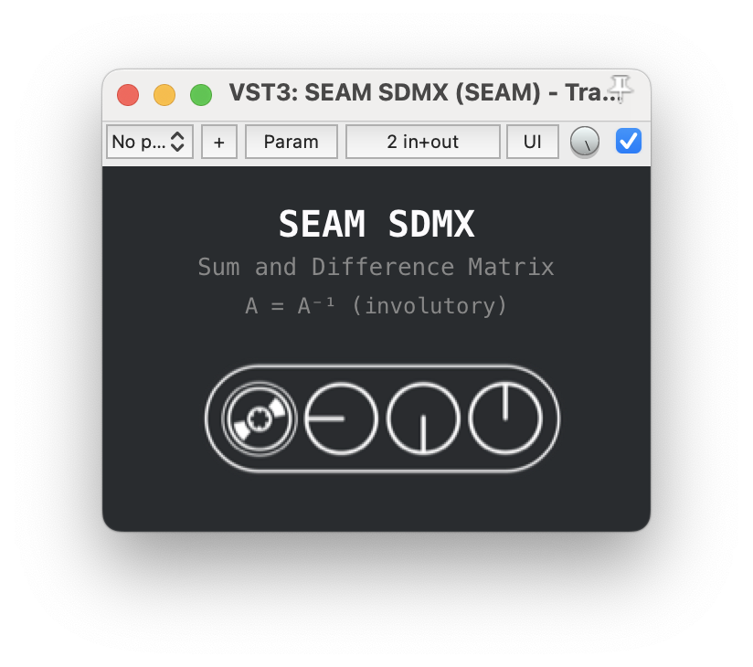
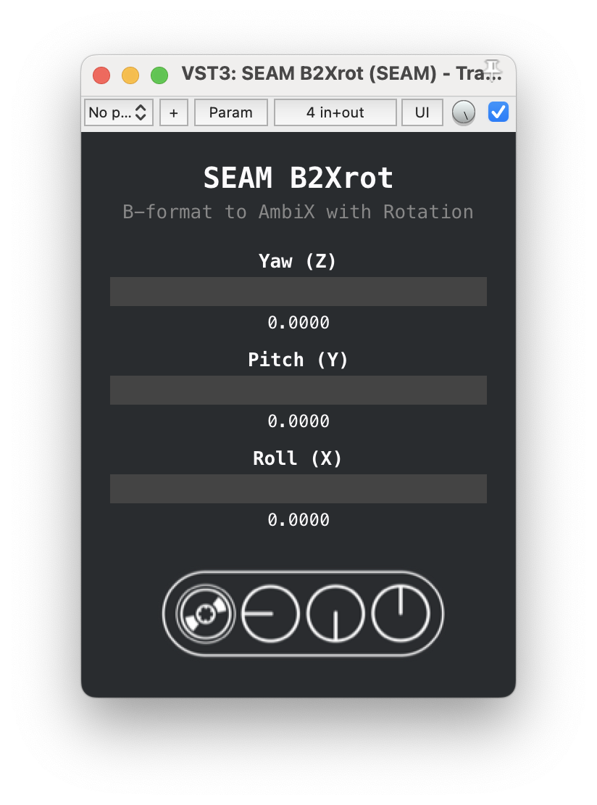
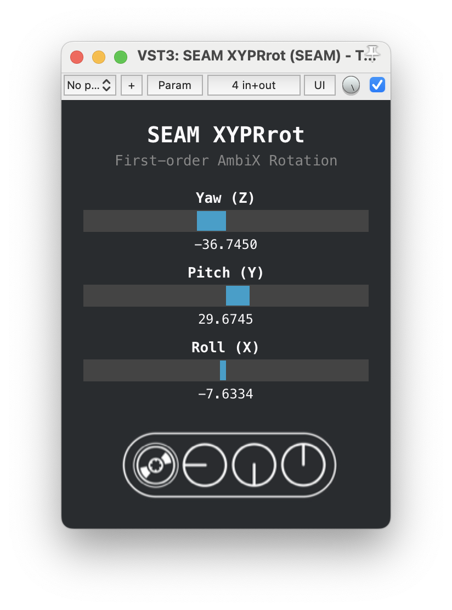
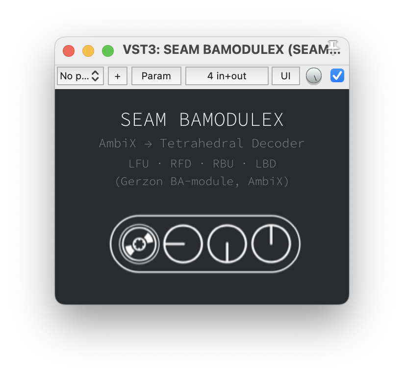
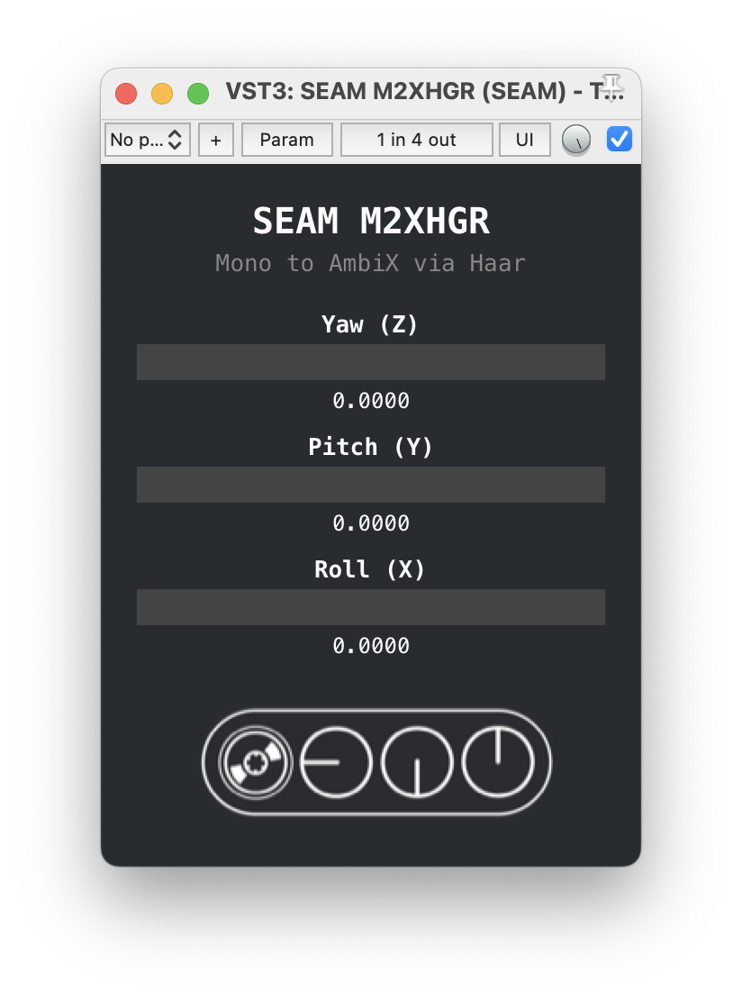
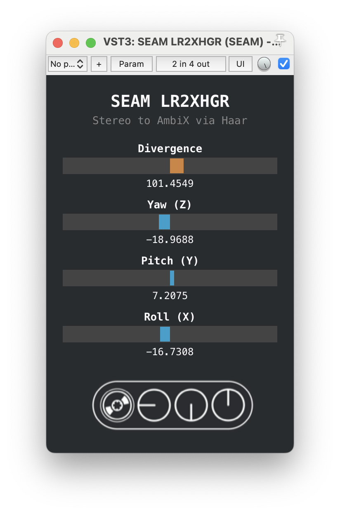
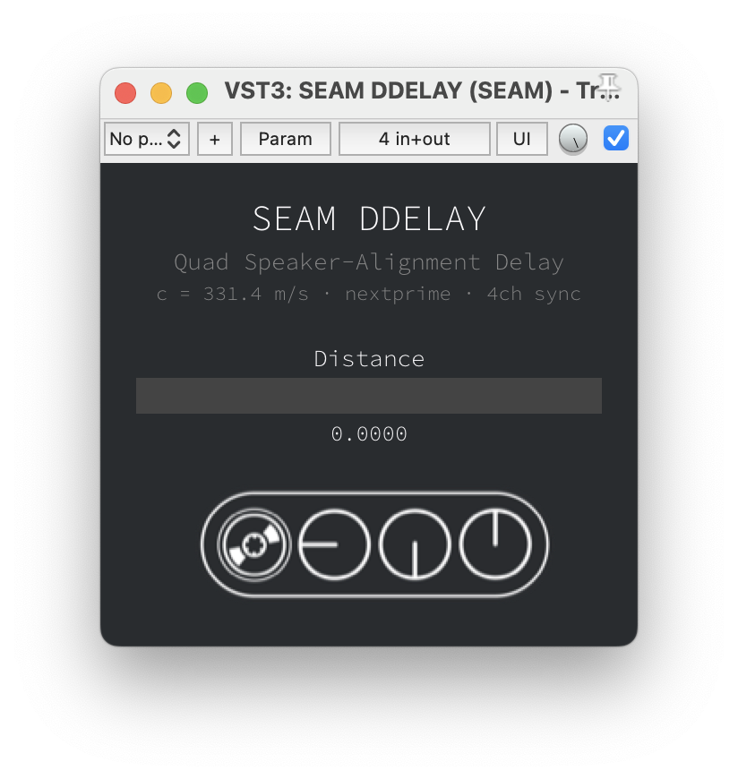

# SEAM-LTM — Learning Through Making


A pedagogical VST3 plugin suite for the [SEAM](https://github.com/s-e-a-m)
project (Sustained Electro-Acoustic Music).

Eight plugins built directly on the Steinberg VST3 SDK — no JUCE, no
frameworks. Clean C++17, VSTGUI for the interface, and the minimum code
needed to do the job.

## Plugins

| Plugin | I/O | Description |
|---|---|---|
| **SDMX** | stereo &rarr; stereo | Sum and Difference Matrix (MS encoding/decoding). Involutory: A = A⁻¹ |
| **B2Xrot** | B-format &rarr; AmbiX | Classic B-format to first-order AmbiX conversion with YPR rotation |
| **M2XHGR** | mono &rarr; AmbiX | Mono to first-order AmbiX via Haar encoding with YPR rotation |
| **LR2XHGR** | stereo &rarr; AmbiX | Stereo to first-order AmbiX via Haar with divergence control and YPR rotation |
| **XYPRrot** | AmbiX &rarr; AmbiX | First-order AmbiX rotation (Yaw, Pitch, Roll) |
| **BAMODULEX** | AmbiX &rarr; tetrahedral (4ch) | Gerzon BA-module (AmbiX variant): decoder to LFU/RFD/RBU/LBD loudspeakers |
| **DDELAY** | 4ch &rarr; 4ch | Quad distance delay for loudspeaker time-alignment. Distance in metres → integer-sample delay (c = 331.4 m/s, nextprime quantized) |
| **MULTIPINK** | none &rarr; 1..64ch | Multichannel pink noise generator with shared 64-slot logical pool. Layout-adaptive (mono → 64ch). RMS-calibrated output (-23/-20/-18 dBFS RMS, ±6 dB trim). Cross-instance decorrelation via static slot allocator |
| **X2UHJ** | AmbiX 4ch &rarr; UHJ C-format 4ch | First-Order AmbiX (ACN/SN3D) to UHJ C-format (L,R,T,Q). "UHJ decoder" for 2-channel listening; analytic quadrature pair (re-derived, SR-correct, ~1.36° max phase error). Stateless |

### Screenshots

| SDMX | B2Xrot | XYPRrot | BAMODULEX |
|:---:|:---:|:---:|:---:|
|  |  |  |  |

| M2XHGR | LR2XHGR | DDELAY |
|:---:|:---:|:---:|
|  |  |  |

## Installation

Prebuilt VST3 bundles are attached to each
[release](https://github.com/s-e-a-m/seam-ltm/releases/latest). The macOS
builds are **universal binaries** (Intel `x86_64` + Apple Silicon `arm64`).

> To build from source instead, skip to [Requirements](#requirements).

### macOS

The bundles are **not code-signed or notarized** (no Apple Developer ID).
Gatekeeper will therefore quarantine them on download and refuse to load them
until you clear the quarantine attribute. This is a one-time step per download.

```bash
# 1. Unzip the downloaded bundle(s)
cd ~/Downloads
unzip 'multipink-*-macOS.vst3.zip'

# 2. Install into the standard user VST3 path
cp -R multipink.vst3 ~/Library/Audio/Plug-Ins/VST3/

# 3. Clear the Gatekeeper quarantine flag (-r: .vst3 is a bundle/directory)
xattr -dr com.apple.quarantine ~/Library/Audio/Plug-Ins/VST3/multipink.vst3

# 4. Rescan plugins in your DAW
```

To install and unblock **all** plugins at once:

```bash
xattr -dr com.apple.quarantine ~/Library/Audio/Plug-Ins/VST3/*.vst3
```

Verify a bundle is clean (the command should print **no**
`com.apple.quarantine` line):

```bash
xattr -l ~/Library/Audio/Plug-Ins/VST3/multipink.vst3
```

Alternatively, after the first blocked load attempt you can authorize each
plugin via **System Settings → Privacy & Security → "Open Anyway"** — but the
`xattr` route is faster and covers every plugin in one command.

### Linux

Copy the `.vst3` bundles into a standard VST3 search path:

```bash
mkdir -p ~/.vst3
cp -R *.vst3 ~/.vst3/
```

No quarantine mechanism exists on Linux; the plugins load once your host
rescans them.

## Requirements

### VST3 SDK

The plugins depend on the [VST3 SDK](https://github.com/steinbergmedia/vst3sdk),
cloned **with submodules** alongside this repo:

```bash
git clone --recursive https://github.com/steinbergmedia/vst3sdk.git
```

> **Note:** the `--recursive` flag is essential — it pulls VSTGUI and other
> components needed for the build.

The expected directory layout is:

```
some-folder/
├── vst3sdk/       ← git clone --recursive here
└── seam-ltm/      ← this repo
```

If your SDK is elsewhere, pass the path at configure time:

```bash
cmake -B build-release -DSEAM_VST3SDK_DIR=/path/to/vst3sdk
```

### CMake

- CMake 3.25+

### macOS

- Xcode (not just Command Line Tools — the SDK cmake needs the full app)
- Tested on macOS 15 Sequoia

### Linux (Arch / Manjaro)

```bash
sudo pacman -S base-devel cmake gcc pkg-config \
    libx11 libxcb xcb-util xcb-util-cursor \
    cairo pango fontconfig freetype2 \
    libxkbcommon gtk3
```

### Linux (Debian / Ubuntu)

```bash
sudo apt install build-essential cmake pkg-config \
    libx11-dev libxcb1-dev libxcb-util-dev libxcb-cursor-dev \
    libcairo2-dev libpango1.0-dev libfontconfig1-dev libfreetype6-dev \
    libxkbcommon-dev libgtk-3-dev
```

### GCC 15 note

The VSTGUI header `iplatformtaskexecutor.h` is missing `#include <cstdint>`,
which causes a build failure on GCC 15+ (Arch, Manjaro, Fedora).
The CMake configuration **patches this automatically** at configure time —
no manual intervention needed.

## Build

### macOS

```bash
cmake -B build-release -DCMAKE_BUILD_TYPE=Release -GXcode
cmake --build build-release --config Release -j8
```

Plugins are output to `build-release/VST3/Release/` and automatically
symlinked to `~/Library/Audio/Plug-Ins/VST3/`.

### Linux

```bash
cmake -B build-release -DCMAKE_BUILD_TYPE=Release
cmake --build build-release --config Release -j$(nproc)
```

Plugins are output to `build-release/VST3/Release/`.
To install system-wide:

```bash
# Copy all .vst3 bundles to the standard VST3 path
cp -r build-release/VST3/Release/*.vst3 ~/.vst3/
```

Most Linux DAWs (Ardour, REAPER, Bitwig, Carla) scan `~/.vst3/` automatically.

## Design

### DSP
Each plugin implements its DSP in a single `processMatrix` or
`processAudio` template, supporting both 32-bit and 64-bit sample formats.
The math follows the Faust reference implementations in
[seam.stereophony.lib](https://github.com/s-e-a-m/faust-libraries) and
the Gerzon/Blumlein theoretical framework.

### GUI
All plugins share a consistent visual identity:

- **300px wide**, variable height
- **Source Code Pro Light** monospace font throughout
- Dark background (#292c2f), light text
- Horizontal sliders with center-origin fill (bipolar rotation controls)
- SEAM logo at bottom

### Architecture
Built on `SingleComponentEffect` (processor + controller in one class).
No external dependencies beyond the VST3 SDK and VSTGUI.
Cross-platform: macOS (Xcode) and Linux (GCC/Clang).

## Theory

The plugin suite covers the Blumlein &rarr; Gerzon lineage of spatial audio:

- **Blumlein (1933)**: sum-and-difference matrix for MS stereophony
- **Gerzon (1973)**: Ambisonics as a generalization of Blumlein's principles
- **Haar transform**: orthogonal encoding of stereo/mono signals into Ambisonic B-format

## License

GPL-3.0 — see [LICENSE](LICENSE).

## Author

Giuseppe Silvi — [s-e-a-m](https://github.com/s-e-a-m)
