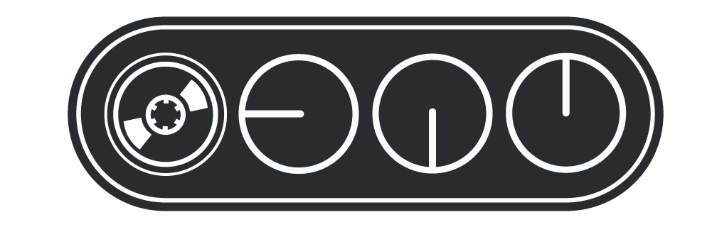
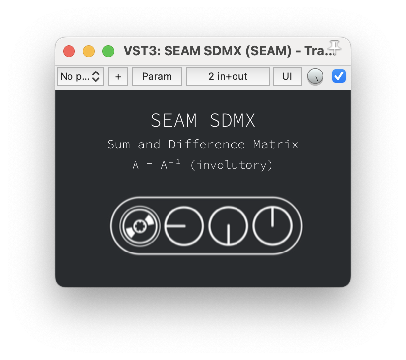
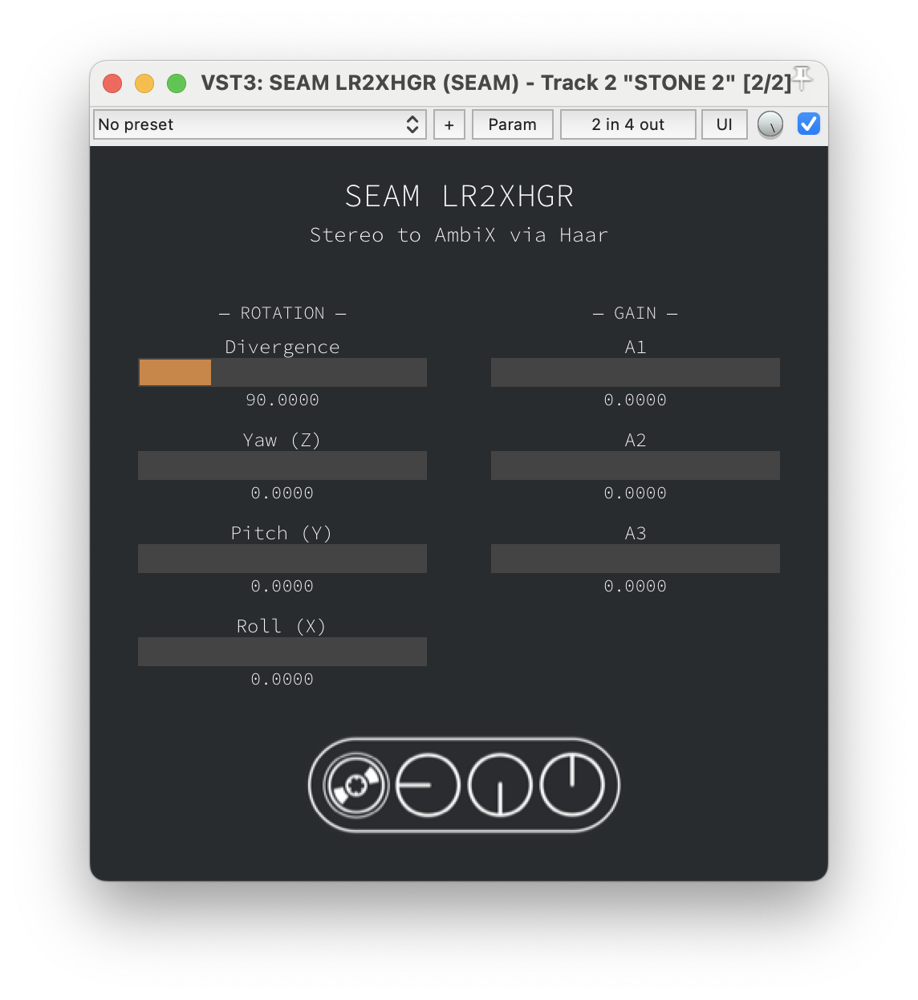
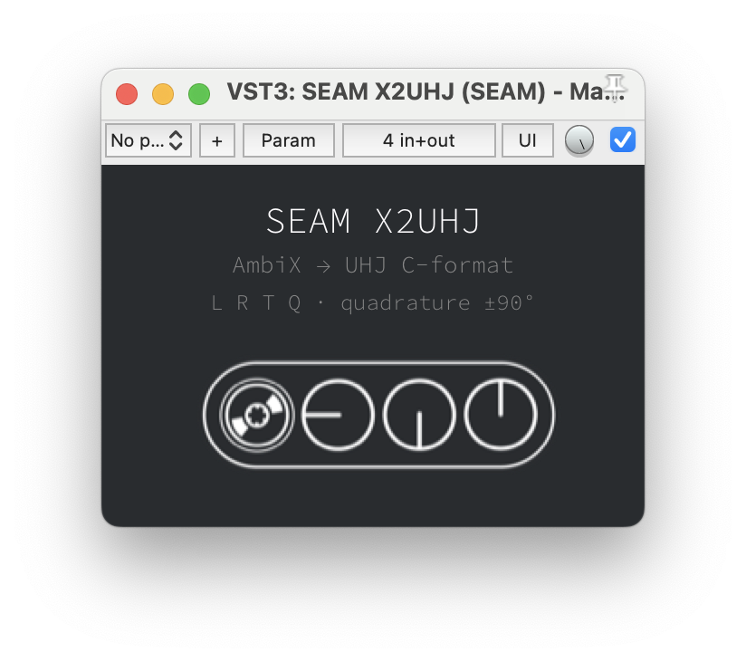
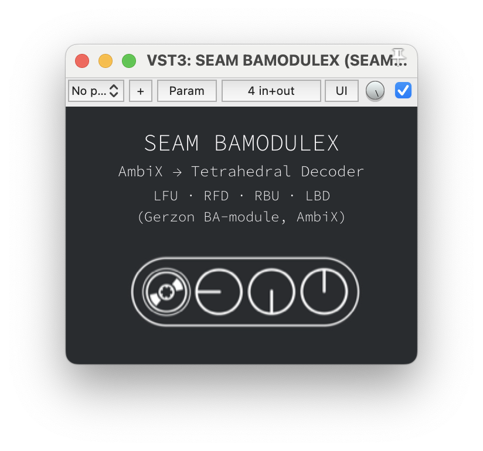
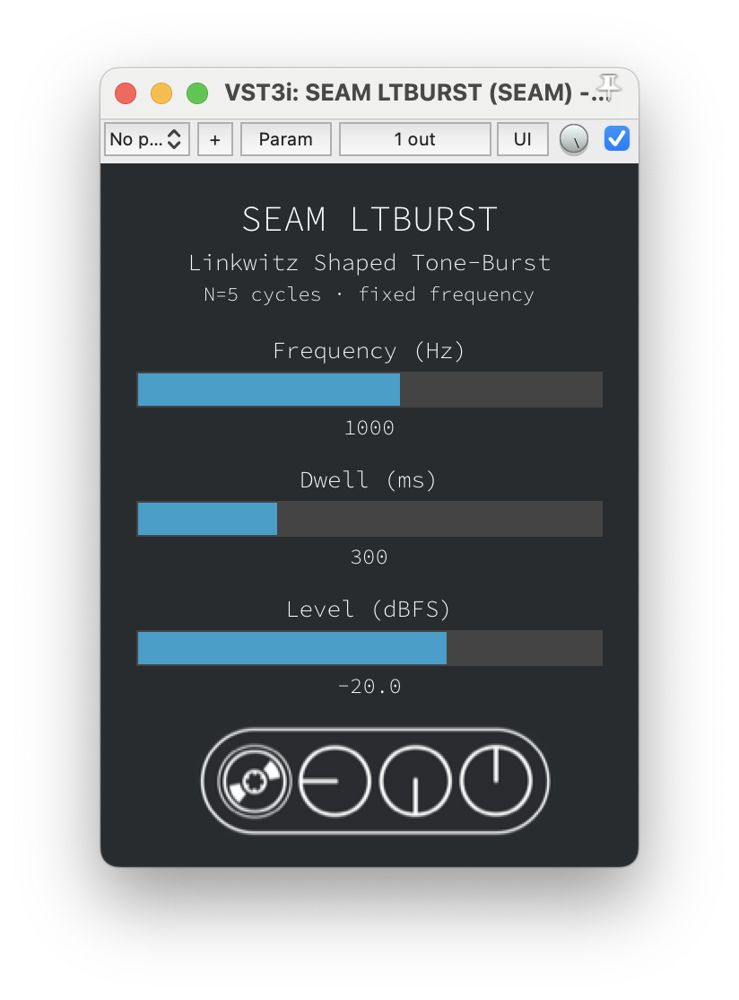
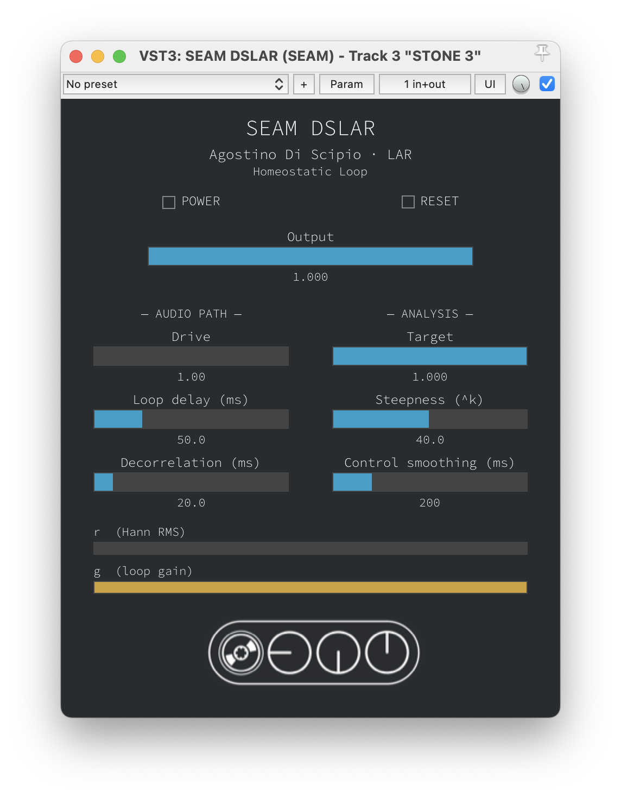
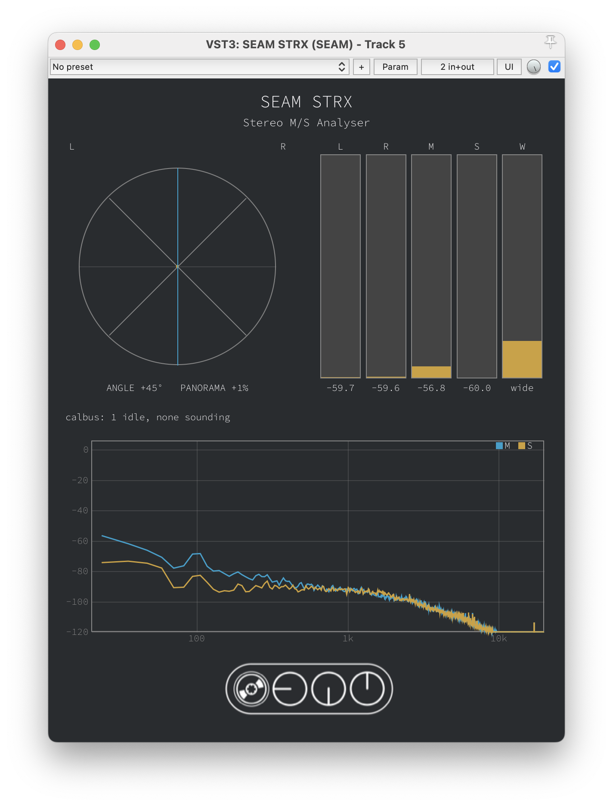

# SEAM-LTM — Learning Through Making



A pedagogical VST3 plugin suite for the [SEAM](https://github.com/s-e-a-m)
project (Sustained Electro-Acoustic Music).

Fifteen plugins built directly on the Steinberg VST3 SDK — no JUCE, no
frameworks. Clean C++17, VSTGUI for the interface, and the minimum code
needed to do the job.

## Plugins

The suite falls into three families: converters that move a signal from one
spatial format to another, generators that produce the test signals a room
is measured with, and the measurement and processing tools that listen to
the result.
Every window follows the same grammar, described in
[doc/style/ui-style.md](doc/style/ui-style.md) and enforced by
`tools/check-uidesc.py` as part of `ctest`.

### Format converters and rotators

| Plugin | I/O | Description |
|---|---|---|
| **SDMX** | stereo &rarr; stereo | Sum and Difference Matrix (Blumlein M/S). The matrix is involutory (A = A⁻¹), so one instance encodes LR &rarr; MS and a second one decodes MS &rarr; LR |
| **B2XROT** | B-format 4ch &rarr; AmbiX 4ch | B-format (FuMa) to AmbiX with rotation: W is scaled by √2, channels are reordered to ACN/SN3D, then Yaw/Pitch/Roll is applied |
| **XYPRROT** | AmbiX 4ch &rarr; AmbiX 4ch | First-order AmbiX rotation (Yaw, Pitch, Roll). Channel A0 is omnidirectional and passes through untouched |
| **M2XHGR** | mono &rarr; AmbiX 4ch | Mono to AmbiX via Haar Decomposition: the Haar QMF bank `haarmn(1)` spreads one channel across four spatial components, which are then rotated by Yaw/Pitch/Roll |
| **LR2XHGR** | stereo &rarr; AmbiX 4ch | Stereo to AmbiX via Haar (Silvi's method): each channel is Haar-decomposed, placed by a Divergence half-angle, summed, and finally oriented by a global Yaw/Pitch/Roll |
| **ABMODULEX** | A-format 4ch &rarr; AmbiX 4ch | Tetrahedral microphone A-format to first-order AmbiX: LFU RFD RBU LBD &rarr; A0 A1 A2 A3. Pure matrix, involutory (M² = I), the inverse of BAMODULEX, and the front end of the TETRAREC chain |
| **BAMODULEX** | AmbiX 4ch &rarr; tetrahedral 4ch | Gerzon's BA-module in the AmbiX domain: a decoder to the LFU · RFD · RBU · LBD vertices, which are the four drivers of a STONE loudspeaker. The Gerzon compensation shelves are omitted by design — the STONE amplifier corrects HF/LF downstream |
| **X2UHJ** | AmbiX 4ch &rarr; UHJ C-format 4ch | First-order AmbiX (ACN/SN3D) to UHJ C-format (L, R, T, Q) — the "UHJ decoder" that makes an Ambisonic mix audible on two channels. The ±90° quadrature pair is designed live at the host sample rate by the shared `seam_quadrature` engine, and the GUI reads out the resulting coefficients together with the achieved maximum phase error |

### Signal generators

| Plugin | I/O | Description |
|---|---|---|
| **LTBURST** | none &rarr; mono | Linkwitz shaped tone-burst: N = 5 cycles of a sine under a Hann window, repeated at a fixed frequency. Frequency, Dwell and Level are the whole interface |
| **LTGLIDE** | none &rarr; mono | Linkwitz glissando tone-burst: the carrier of each N = 5 grain is latched from a linear or exponential sweep F0 &rarr; F1 spread over a Sweep Time, with grains spaced in step or gap timing. It loops, declares a STONE id, and publishes what it is playing on the calibration bus |
| **MULTIPINK** | none &rarr; 1..64ch | Multichannel pink noise drawn from a shared 64-slot logical pool, so that separate instances never emit the same stream. Layout-adaptive from mono to 64 channels, RMS-calibrated (-23/-20/-18 dBFS RMS reference, ±6 dB trim), with a POWER switch, a STONE id, and a calibration-bus announcement |

### Measurement and processing

| Plugin | I/O | Description |
|---|---|---|
| **STRX** | stereo &rarr; stereo | Stereo M/S Analyser: goniometer, overlaid M/S Welch spectra, and In L / In R / M / S / Width meters, plus a status line fed by the calibration bus. It observes only — the audio is passed through unchanged and there are no automatable parameters |
| **DSLAR** | mono &rarr; mono | Agostino Di Scipio's LAR homeostatic loop, hand-ported from `LAR.pd`: the feedforward half of a Larsen system whose loop is closed acoustically by the room. Drive, loop delay, decorrelation, target, steepness and control smoothing, with live r (Hann RMS) and g (loop gain) readouts |
| **DDELAY** | 4ch &rarr; 4ch | Quad Alignment Delay for loudspeaker time-alignment. A distance in metres becomes an integer-sample delay at c = 331.4 m/s, rounded up to the next prime so that several instances stay incommensurable. All four channels share one value |
| **HILBERT** | mono &rarr; stereo | Wideband Quadrature Transformer: one input becomes an in-phase and a quadrature branch held −90° apart from 20 Hz to 20 kHz. Both outputs are all-pass filtered, since the relationship belongs to the pair rather than to either signal. Two topologies — RBJ biquad cascade and Niemitalo polyphase — are selectable live and redesigned per sample rate by the same `seam_quadrature` engine X2UHJ uses internally |

### Screenshots

| SDMX | LR2XHGR | X2UHJ | BAMODULEX |
|:---:|:---:|:---:|:---:|
|  |  |  |  |

| LTBURST | DSLAR | STRX |
|:---:|:---:|:---:|
|  |  |  |

The remaining windows changed with the UI standard and their screenshots are
being retaken.

## Installation

Prebuilt VST3 bundles are attached to each
[release](https://github.com/s-e-a-m/seam-ltm/releases/latest). The macOS
builds are **universal binaries** (Intel `x86_64` + Apple Silicon `arm64`).

> To build from source instead, skip to [Requirements](#requirements).

### macOS

The bundles are **not code-signed or notarized** (no Apple Developer ID).
Gatekeeper will therefore quarantine them on download and refuse to load them
until you clear the quarantine attribute. This is a one-time step per download.

```bash
# 1. Unzip the downloaded bundle(s)
cd ~/Downloads
unzip 'multipink-*-macOS.vst3.zip'

# 2. Install into the standard user VST3 path
cp -R multipink.vst3 ~/Library/Audio/Plug-Ins/VST3/

# 3. Clear the Gatekeeper quarantine flag (-r: .vst3 is a bundle/directory)
xattr -dr com.apple.quarantine ~/Library/Audio/Plug-Ins/VST3/multipink.vst3

# 4. Rescan plugins in your DAW
```

To install and unblock **all** plugins at once:

```bash
xattr -dr com.apple.quarantine ~/Library/Audio/Plug-Ins/VST3/*.vst3
```

Verify a bundle is clean (the command should print **no**
`com.apple.quarantine` line):

```bash
xattr -l ~/Library/Audio/Plug-Ins/VST3/multipink.vst3
```

Alternatively, after the first blocked load attempt you can authorize each
plugin via **System Settings → Privacy & Security → "Open Anyway"** — but the
`xattr` route is faster and covers every plugin in one command.

### Linux

Copy the `.vst3` bundles into a standard VST3 search path:

```bash
mkdir -p ~/.vst3
cp -R *.vst3 ~/.vst3/
```

No quarantine mechanism exists on Linux; the plugins load once your host
rescans them.

## Requirements

### VST3 SDK

The plugins depend on the [VST3 SDK](https://github.com/steinbergmedia/vst3sdk),
cloned **with submodules** alongside this repo:

```bash
git clone --recursive https://github.com/steinbergmedia/vst3sdk.git
```

> **Note:** the `--recursive` flag is essential — it pulls VSTGUI and other
> components needed for the build.

The expected directory layout is:

```
some-folder/
├── vst3sdk/       ← git clone --recursive here
└── seam-ltm/      ← this repo
```

If your SDK is elsewhere, pass the path at configure time:

```bash
cmake -B build-release -DSEAM_VST3SDK_DIR=/path/to/vst3sdk
```

### CMake

- CMake 3.25+

### macOS

- Xcode (not just Command Line Tools — the SDK cmake needs the full app)
- Tested on macOS 15 Sequoia

### Linux (Arch / Manjaro)

```bash
sudo pacman -S base-devel cmake gcc pkg-config \
    libx11 libxcb xcb-util xcb-util-cursor \
    cairo pango fontconfig freetype2 \
    libxkbcommon gtk3
```

### Linux (Debian / Ubuntu)

```bash
sudo apt install build-essential cmake pkg-config \
    libx11-dev libxcb1-dev libxcb-util-dev libxcb-cursor-dev \
    libcairo2-dev libpango1.0-dev libfontconfig1-dev libfreetype6-dev \
    libxkbcommon-dev libgtk-3-dev
```

### GCC 15 note

The VSTGUI header `iplatformtaskexecutor.h` is missing `#include <cstdint>`,
which causes a build failure on GCC 15+ (Arch, Manjaro, Fedora).
The CMake configuration **patches this automatically** at configure time —
no manual intervention needed.

## Build

### macOS

```bash
cmake -B build-release -DCMAKE_BUILD_TYPE=Release -GXcode
cmake --build build-release --config Release -j8
```

Plugins are output to `build-release/VST3/Release/` and automatically
symlinked to `~/Library/Audio/Plug-Ins/VST3/`.

### Linux

```bash
cmake -B build-release -DCMAKE_BUILD_TYPE=Release
cmake --build build-release --config Release -j$(nproc)
```

Plugins are output to `build-release/VST3/Release/`.
To install system-wide:

```bash
# Copy all .vst3 bundles to the standard VST3 path
cp -r build-release/VST3/Release/*.vst3 ~/.vst3/
```

Most Linux DAWs (Ardour, REAPER, Bitwig, Carla) scan `~/.vst3/` automatically.

## Design

### DSP
Each plugin implements its DSP in a single `processMatrix`, `processBlock`
or `processAudio` template, supporting both 32-bit and 64-bit sample formats.
The math follows the Faust reference implementations in the
[SEAM Faust libraries](https://github.com/s-e-a-m/faust-libraries) —
`seam.stereophony.lib`, `seam.ambisonics.lib`, `seam.analyzers.lib`,
`seam.linkwitz.lib`, `seam.noises.lib`, `seam.discipio.lib` and
`seam.math.lib`.
Faust is the specification and readable C++ is the deliverable: every
processor header opens with a `FAUST REFERENCE` block naming the definition
it re-implements by hand, so that a student can read the DSP from the source
in front of them.
Code shared between plugins lives in `plugins/_common/` — the Haar bank, the
quadrature designer, the FFT, the rotation matrices, the meters — and the
peer-aware calibration bus lives in `plugins/_common/calbus/`, compiled once
into its own dylib because static state does not cross `.vst3` module
boundaries.

### GUI
All plugins share a consistent visual identity:

- Two formats decided by the control count: **S**, 300 px wide and a single
  column, up to about five fine controls; **L**, 460 px or wider and two
  columns, from about six. Height varies with content
- Zones in a fixed vertical order: HEADER, SETUP, OPS, FINE, FOOTER
- **Source Code Pro Light** monospace font throughout
- Dark background (#292c2f), light text
- Horizontal sliders with center-origin fill (bipolar rotation controls)
- SEAM logo at bottom

The window grammar is written down in [doc/style/ui-style.md](doc/style/ui-style.md),
started from `plugins/_template/`, and checked by `tools/check-uidesc.py` as
part of `ctest`.

### Architecture
Built on `SingleComponentEffect` (processor + controller in one class).
No external dependencies beyond the VST3 SDK and VSTGUI.
Cross-platform: macOS (Xcode) and Linux (GCC/Clang).

## Theory

The plugin suite covers the Blumlein &rarr; Gerzon lineage of spatial audio,
the measurement practice that a loudspeaker array needs, and one work of
live electronics:

- **Blumlein (1933)**: sum-and-difference matrix for MS stereophony
- **Gerzon (1973)**: Ambisonics as a generalization of Blumlein's principles
- **Haar transform**: orthogonal encoding of stereo/mono signals into Ambisonic B-format
- **Linkwitz (1978, 1980)**: shaped tone-burst testing, the signal LTBURST and LTGLIDE emit
- **Di Scipio**: the LAR homeostatic feedback system that DSLAR re-implements

## License

GPL-3.0 — see [LICENSE](LICENSE).

## Author

Giuseppe Silvi — [s-e-a-m](https://github.com/s-e-a-m)
